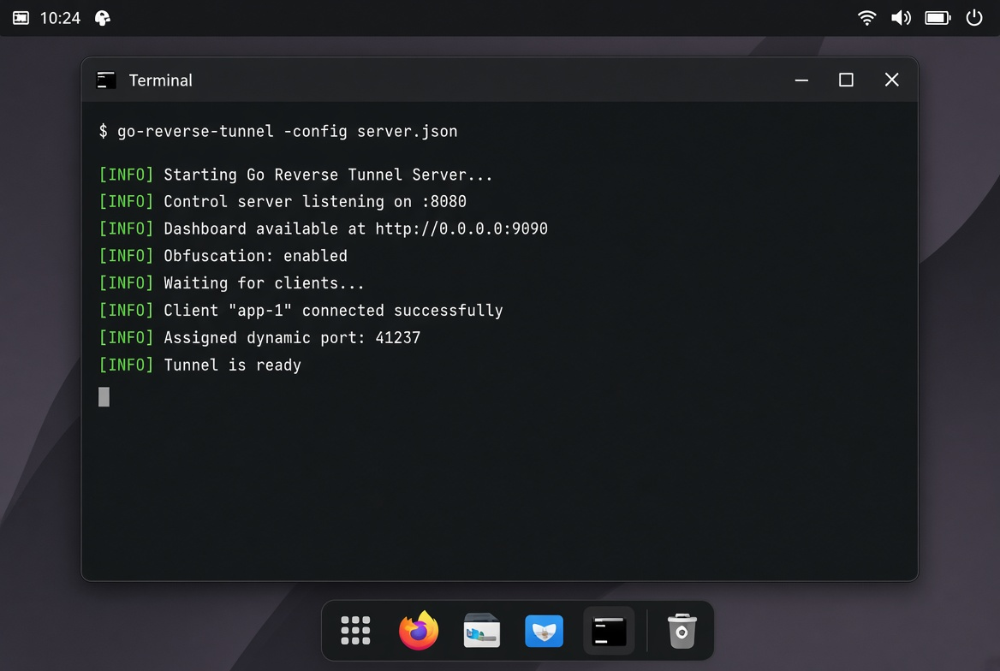
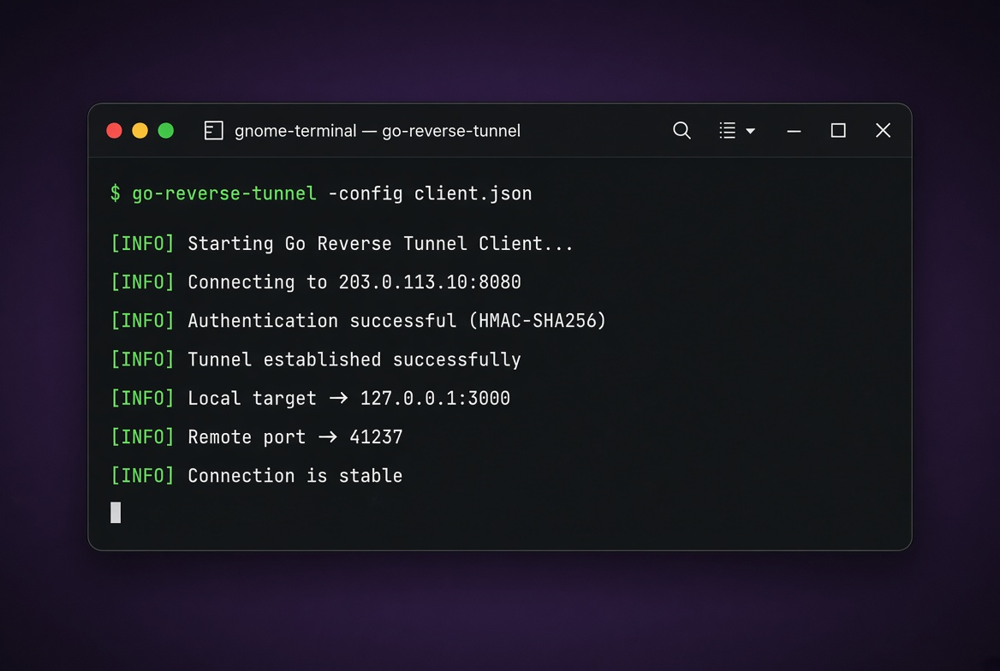
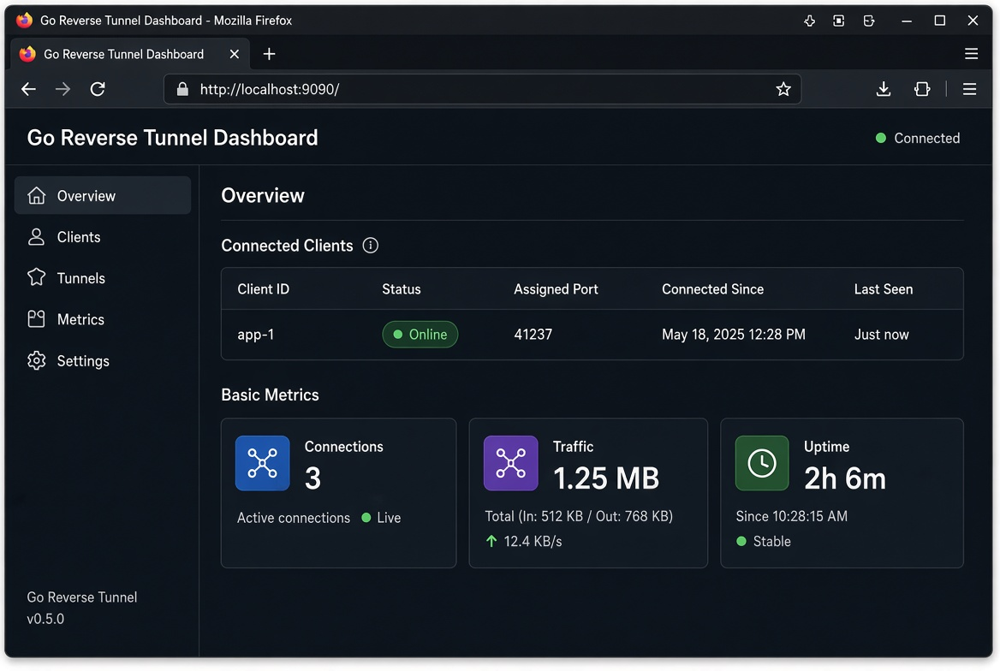

<p align="center">
  
</p>

<p align="center">
  <strong>ابزار تونل معکوس با عملکرد بالا، امن و سبک نوشته‌شده با Go</strong>
</p>

<p align="center">
  <a href="https://go.dev/"></a>
  <a href="https://opensource.org/licenses/MIT"></a>
  <a href="https://github.com/sepantartd/go-reverse-tunnel/releases"></a>
  <a href="https://github.com/sepantartd/go-reverse-tunnel/stargazers"></a>
  <a href="https://github.com/sepantartd/go-reverse-tunnel/actions"></a>
</p>

<p align="center">
  <a href="README.md">English</a> •
  <a href="README_FA.md">فارسی</a>
</p>

---

## تصاویر

<p align="center">
  
  &nbsp;
  
</p>

<br>

<p align="center">
  
</p>

---


## معرفی

**Go Reverse Tunnel** یک ابزار تونل معکوس با کارایی بالا، امن و سبک است که به زبان Go نوشته شده.  
با این ابزار می‌توانید سرورهای محلی پشت NAT یا فایروال را از طریق یک سرور با IP عمومی در دسترس اینترنت قرار دهید.

---

## ویژگی‌های کلیدی

- **تخصیص پورت داینامیک:** پورت را `0` بگذارید تا سرور به‌صورت خودکار یک پورت آزاد از بازه مشخص‌شده به کلاینت اختصاص دهد.
- **Multiplexing با Yamux:** هزاران اتصال همزمان روی یک اتصال TCP/TLS واحد.
- **مبهم‌سازی ترافیک (Obfuscation):** مخفی کردن داده‌های handshake اولیه قبل از TLS برای دور زدن سیستم‌های DPI.
- **احراز هویت HMAC-SHA256:** احراز هویت امن challenge-response بدون ارسال مستقیم توکن روی شبکه.
- **پشتیبانی از TLS و Auto-TLS (Let's Encrypt):** پشتیبانی از گواهی سفارشی و دریافت خودکار گواهی از Let's Encrypt.
- **فورواردینگ ترافیک UDP:** پشتیبانی بومی از تونل کردن ترافیک UDP (بازی، DNS، VoIP و غیره).
- **محدودسازی نرخ (Rate Limiting):** محافظت از endpointهای کنترل در برابر سوءاستفاده و حملات DoS.
- **داشبورد، متریک و pprof:** خروجی متریک‌های Prometheus، داشبورد وضعیت زنده و endpointهای pprof محافظت‌شده با توکن.
- **هشدار Webhook:** ارسال فوری هشدار برای شکست احراز هویت، اتصال و قطع اتصال کلاینت‌ها.

---

## مقایسه با ابزارهای مشابه

| ویژگی                        | **go-reverse-tunnel** | frp          | chisel       | ngrok        | Cloudflare Tunnel |
|-----------------------------|-----------------------|--------------|--------------|--------------|-------------------|
| **Self-hosted**             | ✅                    | ✅           | ✅           | ❌           | ❌ (edge)         |
| **TCP**                     | ✅                    | ✅           | ✅           | ✅           | محدود             |
| **UDP**                     | ✅                    | ✅           | ✅           | ❌           | محدود             |
| **Multiplexing**            | ✅ (Yamux)            | ✅           | ✅           | ✅           | ✅                |
| **Traffic Obfuscation**     | ✅                    | ❌           | ❌           | ❌           | ❌                |
| **HMAC Auth**               | ✅                    | Token        | SSH Auth     | Token        | Token             |
| **Auto TLS (Let's Encrypt)**| ✅                    | پلاگین       | محدود        | ✅           | ✅                |
| **Dashboard + Metrics**     | ✅ (Prometheus)       | ✅           | ❌           | ✅           | محدود             |
| **Rate Limiting**           | ✅                    | ❌           | ❌           | ✅           | ✅                |
| **سبک و Single Binary**     | ✅                    | ✅           | ✅           | Agent        | Agent             |
| **مناسب دور زدن DPI**       | ✅                    | ضعیف         | متوسط        | ضعیف         | متوسط             |


---

## نصب سریع (Linux و Termux)

نصب آخرین باینری از [Releases](https://github.com/sepantartd/go-reverse-tunnel/releases):

```bash
bash <(curl -sL https://raw.githubusercontent.com/sepantartd/go-reverse-tunnel/main/scripts/install.sh)
```

---

## راهنمای استفاده

### ۱. اجرای سرور

فایل `server.json`:

```json
{
  "control_addr": ":8080",
  "token": "my-super-secret-token",
  "log_level": "info",
  "dashboard_addr": ":9090",
  "enable_obfuscation": true,
  "dynamic_port_min": 40000,
  "dynamic_port_max": 50000,
  "clients": [
    {
      "client_id": "app-1",
      "ports": [0, 8081]
    }
  ]
}
```

دستور اجرا:

```bash
go-reverse-tunnel -config server.json
```

### ۲. اجرای کلاینت

فایل `client.json`:

```json
{
  "server_addr": "SERVER_IP:8080",
  "client_id": "app-1",
  "token": "my-super-secret-token",
  "local_target": "127.0.0.1:3000",
  "enable_obfuscation": true,
  "log_level": "info"
}
```

دستور اجرا:

```bash
go-reverse-tunnel -config client.json
```

---

## داشبورد و Profiling

وقتی `dashboard_addr` تنظیم شده باشد، endpointهای محافظت‌شده نیاز به توکن دارند:

- **داشبورد:** `http://SERVER_IP:9090/dashboard?token=my-super-secret-token`
- **متریک‌های Prometheus:** `http://SERVER_IP:9090/metrics?token=my-super-secret-token`
- **pprof Profiler:** `http://SERVER_IP:9090/debug/pprof/?token=my-super-secret-token`

---

## لایسنس

این پروژه تحت [لایسنس MIT](LICENSE) منتشر شده است.
